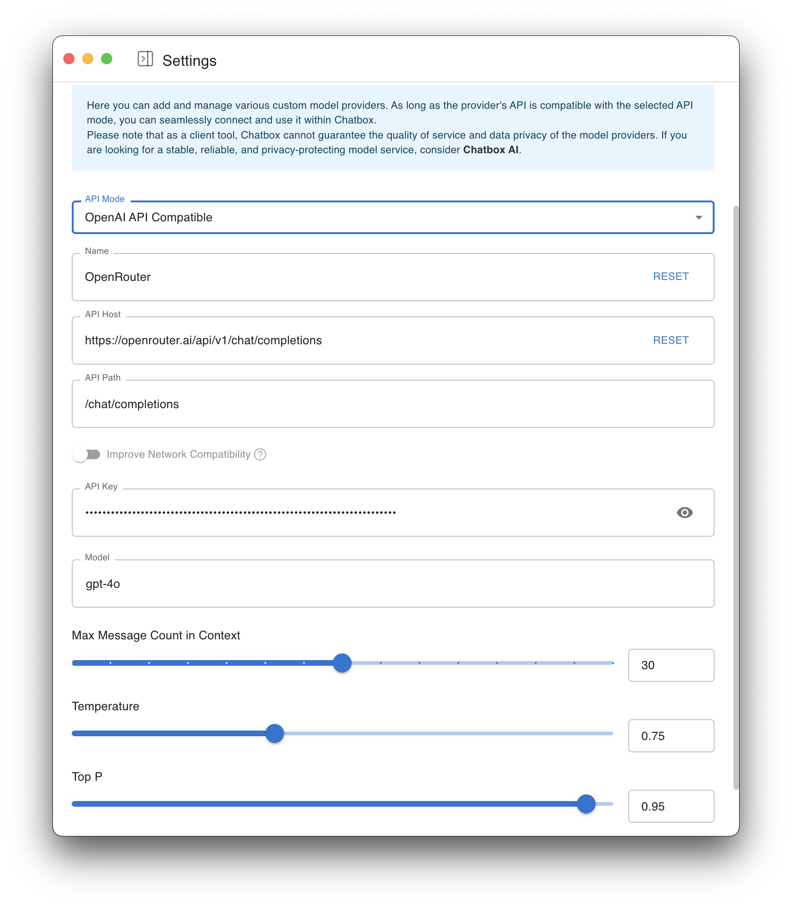
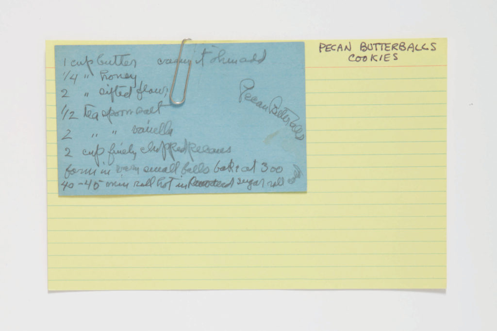
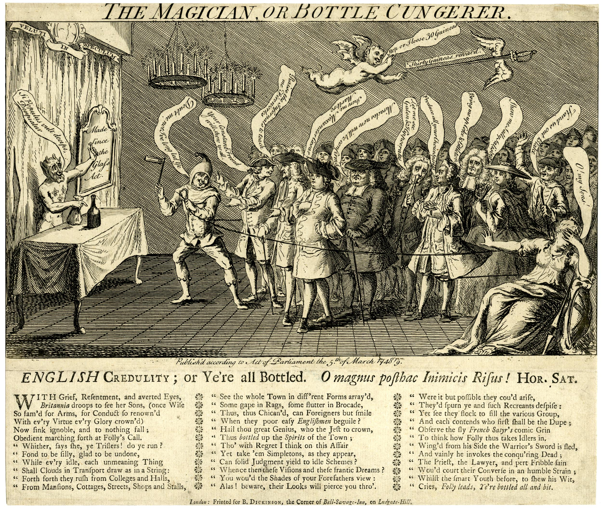

# CUNY GC | AI Prompting Lab

_An interactive guide to language model concepts and prompting techniques._



> This micro workshop introduces key concepts in Large Language Model (LLM) prompting and covers techniques for interacting with AI models, especially in the context of historical research and transcription tasks.

---

## Roadmap

- **Mad-Lib Warm-Up:** A fun introduction to core terminology.
- **OpenRouter Guide:** Setting up your environment to interact with models.
- **Prompting Exercises:** Hands-on tasks to practice prompting techniques.
  - Task 1: Document Completion
  - Task 2: Document Understanding (using vision models)
- **Model Comparisons:** Review output differences between models analyzing the same documents.
  - Example 1: Handwritten recipe card
  - Example 2: Engraved image and poem
- **AI-LLM Glossary:** Key terms for understanding AI basics, prompting, and LLMs.

---

<details>
<summary><strong>Mad-Lib Warm-Up</strong></summary>

**Term Bank:** `API`, `Batch Prompting`, `Model`, `Prompt`, `Role Assignment`, `System Message`, `Temperature`, `Top-p`, `Tokens`, `Training Data`

> **Anatomy of a Prompt:**

```text
A(n) [____] begins with a [____] that tells the [____] which role to play.
By lowering [____] or [____], you shrink the model’s creative range.
Behind the scenes, the request travels through an [____] to the chosen [____].
After slicing language from your prompt into [____], the AI consults its [____] to predict the next steps in the sequence based on [____].
Even so, gym class heroes like to speed things up with [____].
```

</details>

<details>
<summary><strong>AI-LLM Glossary</strong></summary>

### Key Concepts

- **Generative AI:** Content-producing AI trained on large corpora.
- **LLM (Large Language Model):** Transformer-based model trained on massive text datasets.
- **Vision Language Model (VLM):** AI combining image and text understanding.
- **Token:** The basic unit of text input/output for models.
- **Embedding:** A vectorized representation of text meaning.

### Prompting Methods

- **Prompt:** Instruction or query given to a model.
- **Role Assignment:** Directs the model to take on a persona or function.
- **System Message:** Sets behavior before conversation starts.
- **Temperature / Top-p:** Tweaks to randomness and diversity.

### Advanced Techniques

- **Prompt Engineering:** Crafting precise prompts for desired output.
- **Fine-Tuning:** Training a model further on task-specific data.
- **Batch Prompting:** Running multiple prompts for comparison.

</details>

<details>
<summary><strong>OpenRouter Sandbox Guide</strong></summary>

1. Go to: [Chatbox Web Portal](https://web.chatboxai.app/)
2. Navigate to settings -> Model Provider†’ -> Add Custom Provider
3. Fill in:
   - **Name**: `OpenRouter`
   - **API Host**: `https://openrouter.ai/api/v1/chat/completions`
   - **Model**: Choose from:
     - `openai/gpt-4o`
     - `anthropic/claude-3-sonnet`
     - `google/gemini-pro-vision`
     - `mistralai/pixtral-large-2411`

</details>

<details>
<summary><strong>Prompting Exercises</strong></summary>

### Task 1: Document Completion

```prompt
Complete the incomplete paragraph in the following excerpt from a primary source:
[insert-excerpt]
```

- Test different temperatures (e.g., 0.2 vs 0.8) and compare results.

### Task 2: Document Understanding

```system
You are an advanced OCR processing tool for parsing and transcribing historical materials.
```

```prompt
Transcribe the attached image of the document with alt-text for mixed media, filling Dublin Core fields where present.
```

</details>

<details>
<summary><strong>Comparing Model Outputs</strong></summary>

### Example 1: Handwritten Recipe Card

[View Recipe Comparison](pages/recipe.html)  


### Example 2: 18th-Century Satirical Engraving

[View Magician Comparison](pages/magician.html)  


### Reflection Questions

- Which model handles historical texts better?
- Are alt-text descriptions accurate?
- How reliable is metadata extraction?
- How is ambiguity handled?

</details>
